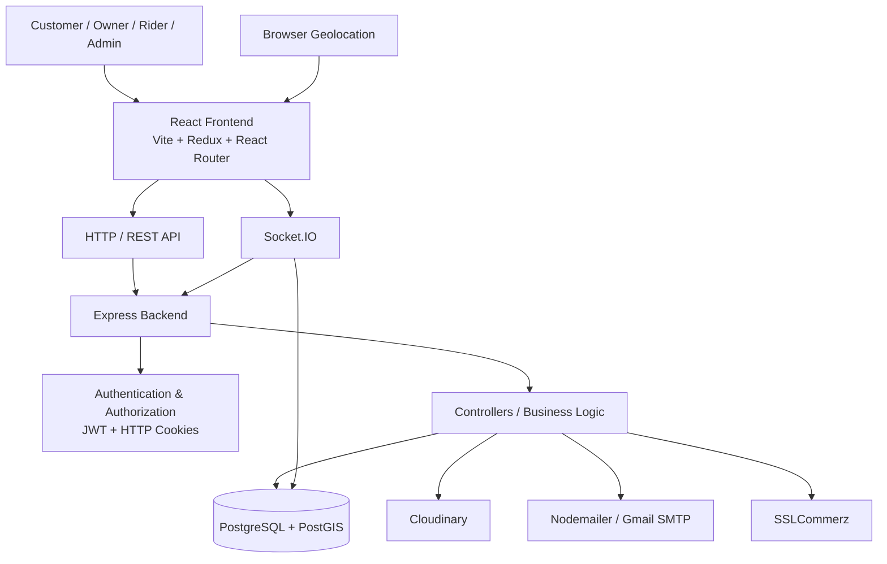
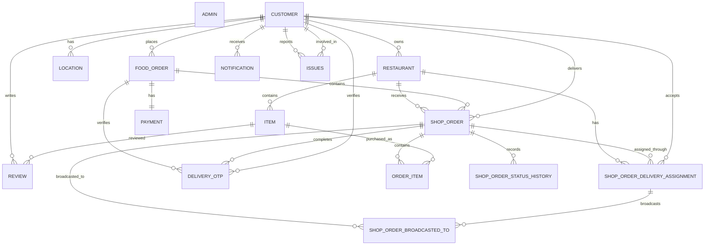

# KhaiDai — Food Ordering & Delivery Platform

> **BUET CSE 2-1 Database Management Sessional Project**

KhaiDai is a full-stack food ordering and delivery platform developed as a database-management sessional project for the **Department of Computer Science and Engineering, Bangladesh University of Engineering and Technology (BUET)**.

The system models a complete food-delivery ecosystem involving **customers, restaurant owners, riders, administrators, restaurants, menu items, orders, delivery assignments, payments, reviews, notifications, issue reports, authentication, and geospatial rider tracking**.

The project was developed primarily by **Swapnil Das**, covering the frontend, backend application development, system integration, and database setup, with **Nazmul Hasan Rafi** contributing substantially to the database design and implementation.

---

## ✨ Features

### Customer
- User registration and authentication
- Role-based account creation for customer, restaurant owner, and rider
- Secure password hashing with `bcrypt`
- JWT-based session authentication using HTTP cookies
- Password-reset workflow using OTP verification
- Automatic location acquisition through browser geolocation
- City-based restaurant and food discovery
- Restaurant browsing and menu inspection
- Food-item search
- Shopping cart management
- Multi-restaurant order creation
- Cash-on-delivery and online-payment order flows
- SSLCommerz payment initialization
- Order history and order tracking
- Real-time rider-location updates
- Delivery completion notifications
- Food-item reviews and ratings
- Issue/complaint reporting

### Restaurant Owner
- Restaurant creation and editing
- Restaurant image upload
- Restaurant open/closed status management
- Food-item CRUD operations
- Food-item image upload
- Item availability control
- Order management
- Order-status transitions
- Completed-order history
- Restaurant delivery statistics
- Item sales statistics
- Customer review/rating aggregation

### Rider
- Rider authentication
- Online/offline presence tracking
- Continuous geolocation updates
- Discovery of nearby broadcasted delivery jobs
- Delivery-job acceptance
- Assigned-order management
- Delivered-order history
- Rider delivery statistics
- Delivery OTP generation and verification
- Real-time delivery tracking

### Administrator
- Dedicated administrator authentication
- Dashboard statistics
- Restaurant approval/rejection
- Restaurant suspension/unsuspension
- Customer/owner/rider inspection
- User suspension/unsuspension
- Pending and suspended restaurant views
- Order inspection
- Issue/complaint inspection
- Protected admin routes

### Database / Backend
- PostgreSQL relational database
- PostGIS geospatial support
- Foreign-key referential integrity
- `ON DELETE CASCADE` relationships where appropriate
- Enumerated domain types
- Database-level `CHECK` constraints
- Partial unique indexes for delivery-assignment invariants
- GIST spatial index for customer locations
- Order-status audit history
- Database triggers for rating aggregation and status history
- PostgreSQL functions for delivery statistics
- PostgreSQL procedure for transactional delivery completion
- Transactional order and delivery operations

---

## 🏗️ System Architecture

KhaiDai follows a layered full-stack architecture:



### Backend request lifecycle

```text
Client
  │
  ▼
Express Router
  │
  ├── Authentication middleware
  │      └── JWT verification / suspension check
  │
  ├── Admin middleware
  │      └── Admin JWT verification
  │
  ▼
Controller
  │
  ├── Validation
  ├── Authorization
  ├── Business rules
  ├── Transaction management
  │
  ▼
PostgreSQL / PostGIS
  │
  ├── Relational queries
  ├── Spatial queries
  ├── Constraints
  ├── Triggers
  ├── Functions
  └── Procedures
```

### Frontend architecture

```text
React Pages
    │
    ├── Components
    ├── Custom Hooks
    ├── Redux Store
    │     ├── userSlice
    │     ├── ownerSlice
    │     ├── riderSlice
    │     ├── adminSlice
    │     └── mapSlice
    │
    └── Axios / Socket.IO Client
             │
             ▼
        Express REST API
        + Socket.IO
```

---

## 🛠️ Tech Stack

| Layer | Technology |
|---|---|
| Frontend | React 19 |
| Build Tool | Vite |
| Styling | Tailwind CSS |
| UI / Icons | Lucide React, React Icons |
| Animation | Framer Motion |
| State Management | Redux Toolkit / Redux |
| Routing | React Router |
| HTTP Client | Axios |
| Maps | Leaflet, React Leaflet |
| Real-Time Client | Socket.IO Client |
| Backend | Node.js |
| API Framework | Express 5 |
| Authentication | JWT + HTTP-only cookies |
| Password Security | bcrypt |
| Database | PostgreSQL |
| Spatial Database | PostGIS |
| Database Driver | node-postgres (`pg`) |
| Real-Time Server | Socket.IO |
| File Upload | Multer |
| Image Storage | Cloudinary |
| Email | Nodemailer + Gmail SMTP |
| Payment Gateway | SSLCommerz |
| Configuration | dotenv |

---

## 📁 Project Structure

```text
buet-cse-2-1-project-food-order-and-delivery-main/
│
├── backend/
│   ├── config/
│   │   ├── database.sql
│   │   ├── checklist_features.sql
│   │   ├── concurrency_hardening.sql
│   │   ├── db.js
│   │   ├── mail.js
│   │   └── generateAdminPassword.js
│   │
│   ├── controllers/
│   │   ├── admin.controllers.js
│   │   ├── auth.controllers.js
│   │   ├── delivery.controllers.js
│   │   ├── deliveryOtp.controllers.js
│   │   ├── forget.controllers.js
│   │   ├── issues.controllers.js
│   │   ├── item.controllers.js
│   │   ├── order.controllers.js
│   │   ├── payment.controllers.js
│   │   ├── restaurant.controllers.js
│   │   ├── rider.controllers.js
│   │   └── user.controllers.js
│   │
│   ├── middlewares/
│   │   ├── adminAuth.js
│   │   ├── isAuth.js
│   │   └── multer.js
│   │
│   ├── routes/
│   │   ├── admin.routes.js
│   │   ├── auth.routes.js
│   │   ├── delivery.routes.js
│   │   ├── issues.routes.js
│   │   ├── item.routes.js
│   │   ├── order.routes.js
│   │   ├── payment.routes.js
│   │   ├── restaurant.routes.js
│   │   ├── rider.routes.js
│   │   └── user.routes.js
│   │
│   ├── utils/
│   │   ├── cloudinary.js
│   │   ├── otp.js
│   │   └── token.js
│   │
│   ├── index.js
│   ├── socket.js
│   └── package.json
│
├── frontend/
│   ├── public/
│   └── src/
│       ├── assets/
│       ├── components/
│       ├── hooks/
│       ├── pages/
│       ├── redux/
│       ├── App.jsx
│       ├── Categories.js
│       ├── index.css
│       └── main.jsx
│
├── testDocs/
│   ├── burger/
│   ├── drink/
│   ├── fries/
│   ├── pizza/
│   └── restaurant/
│
└── README.md
```

### Backend directory responsibilities

- **`routes/`** — HTTP endpoint definitions and middleware attachment.
- **`controllers/`** — application logic, validation, authorization checks, database operations, and response construction.
- **`middlewares/`** — reusable authentication, authorization, and upload middleware.
- **`config/`** — database, mail, schema, and configuration utilities.
- **`utils/`** — reusable JWT, OTP, and Cloudinary helpers.
- **`socket.js`** — Socket.IO connection, identity registration, location updates, and disconnect handling.

### Frontend directory responsibilities

- **`pages/`** — route-level screens.
- **`components/`** — reusable UI and dashboard components.
- **`hooks/`** — API-facing custom hooks.
- **`redux/`** — global application state.
- **`assets/`** — static project assets.

---

## 🔐 Authentication & Authorization

KhaiDai uses two authentication domains.

### User authentication

Customers, restaurant owners, and riders authenticate through:

```text
POST /api/auth/signup
POST /api/auth/signin
GET  /api/auth/signout
```

After successful authentication:

1. Credentials are validated.
2. Passwords are verified using `bcrypt`.
3. A JWT containing user identity and role is generated.
4. The JWT is stored in an HTTP-only cookie.
5. Protected endpoints use `isAuth` middleware.
6. The middleware verifies the JWT and retrieves the authoritative role from PostgreSQL.
7. Suspended users are rejected.

### Admin authentication

Administrators use a separate cookie:

```text
adminToken
```

Admin requests are protected by `adminAuth`, which:

- verifies the JWT;
- verifies that the token role is `admin`;
- attaches administrator information to the request.

### Password reset

The password-reset process is:

```text
Request OTP
    ↓
OTP delivered through email
    ↓
Verify OTP
    ↓
Reset password
```

Reset state is persisted in the `PASSWORD_RESET` table with an OTP hash, expiry timestamp, role, and verification state.

---

## 👥 User Roles & Permissions

| Role | Main Responsibilities |
|---|---|
| Customer | Browse restaurants, manage cart, place orders, pay, track deliveries, review items, report issues |
| Restaurant Owner | Manage restaurant/menu, process orders, update order states, inspect statistics |
| Rider | Discover and accept deliveries, update location, complete deliveries using OTP |
| Administrator | Moderate restaurants/users, inspect orders/issues, manage platform-level operations |

The application stores these roles using PostgreSQL enum values:

```text
customer
owner
rider
```

Administrator authentication is maintained separately through the `ADMIN` table.

---

## 🌐 API Routes

All routes are prefixed by:

```text
http://localhost:<BACKEND_PORT>/api
```

Protected endpoints require the appropriate authentication cookie.

### Authentication Routes

| Method | Endpoint | Purpose |
|---|---|---|
| POST | `/auth/signup` | Register a user |
| POST | `/auth/signin` | Authenticate a user |
| GET | `/auth/signout` | Clear user session |
| POST | `/auth/send-otp` | Send password-reset OTP |
| POST | `/auth/verify-otp` | Verify password-reset OTP |
| POST | `/auth/reset-password` | Reset account password |

### Customer Routes

| Method | Endpoint | Purpose |
|---|---|---|
| GET | `/user/current` | Retrieve current authenticated user |
| PUT | `/user/location` | Update user location |
| GET | `/user/received-orders` | Retrieve received orders |
| GET | `/user/delivery-notifications` | Retrieve delivery notifications |
| PATCH | `/user/delivery-notifications/read` | Mark delivery notifications as read |
| POST | `/order/create` | Create a food order |
| GET | `/order/orders` | Retrieve customer orders |
| GET | `/order/shop-order/:shop_order_id` | Retrieve shop-order details |
| POST | `/payment/initiate` | Initialize online payment |
| POST | `/issues/report` | Submit an issue |
| GET | `/issues/my-issues` | Retrieve own issues |

### Restaurant/Owner Routes

| Method | Endpoint | Purpose |
|---|---|---|
| POST | `/restaurant/create-edit-restaurant` | Create/edit restaurant |
| GET | `/restaurant/get-my` | Retrieve owner's restaurant |
| GET | `/restaurant/my-items` | Retrieve owner's items |
| GET | `/restaurant/get-by-city/:city` | Find restaurants by city |
| GET | `/restaurant/items-city/:city` | Find food items by city |
| GET | `/restaurant/completed-orders` | Retrieve completed restaurant orders |
| GET | `/restaurant/statistics` | Retrieve restaurant delivery statistics |
| PATCH | `/restaurant/toggle-status` | Open/close restaurant |
| GET | `/restaurant/items/:restaurantId` | Retrieve restaurant menu |
| POST | `/item/add-item` | Add menu item |
| POST | `/item/edit-item/:itemId` | Edit menu item |
| DELETE | `/item/delete-item/:itemId` | Delete menu item |
| PATCH | `/item/toggle-availability/:item_id` | Toggle item availability |
| GET | `/item/search-items` | Search food items |
| GET | `/item/total-sold/:itemId` | Retrieve item sales count |
| POST | `/item/rating` | Submit item rating/review |
| PATCH | `/order/shop-order/status` | Update shop-order status |

### Rider Routes

| Method | Endpoint | Purpose |
|---|---|---|
| GET | `/rider/broadcasted-shop-orders` | Retrieve available delivery jobs |
| PUT | `/rider/accept-shop-order` | Accept a delivery job |
| GET | `/rider/assigned-orders` | Retrieve assigned active deliveries |
| GET | `/rider/delivered-orders` | Retrieve delivered orders |
| GET | `/rider/statistics` | Retrieve rider statistics |
| POST | `/rider/send-delivery-otp` | Send delivery-completion OTP |
| POST | `/rider/verify-delivery-otp` | Verify delivery OTP |
| GET | `/delivery/assigned-rider/:shop_order_id` | Retrieve assigned rider information |

### Admin Routes

| Method | Endpoint | Purpose |
|---|---|---|
| POST | `/admin/login` | Admin login |
| POST | `/admin/logout` | Admin logout |
| GET | `/admin/me` | Current admin |
| GET | `/admin/dashboard` | Dashboard statistics |
| GET | `/admin/restaurants` | All restaurants |
| GET | `/admin/restaurants/pending` | Pending restaurants |
| GET | `/admin/restaurants/suspended` | Suspended restaurants |
| GET | `/admin/restaurants/:id` | Restaurant details |
| PATCH | `/admin/restaurants/:id/approve` | Approve restaurant |
| PATCH | `/admin/restaurants/:id/reject` | Reject restaurant |
| PATCH | `/admin/restaurants/:id/suspend` | Suspend restaurant |
| PATCH | `/admin/restaurants/:id/unsuspend` | Unsuspend restaurant |
| PATCH | `/admin/users/:id/suspend` | Suspend user |
| PATCH | `/admin/users/:id/unsuspend` | Unsuspend user |
| GET | `/admin/customers` | List customers |
| GET | `/admin/customers/:id` | Customer details |
| GET | `/admin/owners` | List restaurant owners |
| GET | `/admin/owners/:id` | Owner details |
| GET | `/admin/riders` | List riders |
| GET | `/admin/riders/:id` | Rider details |
| GET | `/admin/suspended-users` | List suspended users |
| GET | `/admin/issues` | List reported issues |
| GET | `/admin/issues/:id` | Issue details |
| GET | `/admin/orders` | List all orders |
| GET | `/admin/orders/:id` | Order details |

### Issue Route Alias

The backend also mounts the same issue router under:

```text
/api/issue
```

in addition to:

```text
/api/issues
```

The canonical application usage is `/api/issues`.

---

## 🗄️ Database Design

The database is implemented using **PostgreSQL with PostGIS**.

The database layer is not merely a persistence layer; it actively enforces business invariants through:

- foreign keys;
- enum types;
- check constraints;
- unique constraints;
- partial unique indexes;
- spatial indexes;
- triggers;
- SQL functions;
- PL/pgSQL procedures;
- transactional locking.

### ER Diagram



### Database Schema

#### `ADMIN`
Stores administrator credentials.

```text
email PK
hashed_password
```

#### `CUSTOMER`
Central user entity for customers, restaurant owners, and riders.

Important attributes:

```text
id PK
name
email UNIQUE
hashed_password
contact_no
role
latitude
longitude
location GEOGRAPHY(POINT, 4326)
socket_id
isonline
created_at
updated_at
```

#### `RESTAURANT`
Represents restaurants managed by owners.

```text
id PK
owner_id FK -> CUSTOMER.id
is_approved
status
name
image_link
description
address
city
latitude
longitude
contact_no
rating
created_at
```

#### `ITEM`
Represents restaurant menu items.

```text
id PK
restaurant_id FK -> RESTAURANT.id
name
category
food_type
description
price
discount_price
image_link
total_sold
rating
rating_count
isavailable
created_at
updated_at
```

#### `LOCATION`
Stores customer-associated road/city information.

#### `FOOD_ORDER`
Represents a customer's top-level order.

```text
id PK
customer_id FK
payment_method
delivery_address
latitude
longitude
total_amount
created_at
updated_at
```

#### `SHOP_ORDER`
Splits a food order by restaurant.

This is important for multi-restaurant ordering because a single `FOOD_ORDER` can contain multiple restaurant-specific `SHOP_ORDER` records.

#### `ORDER_ITEM`
Stores the item-level contents of a shop order.

#### `SHOP_ORDER_DELIVERY_ASSIGNMENT`
Tracks rider assignment lifecycle:

```text
broadcasted
    ↓
assigned
    ↓
completed
```

#### `SHOP_ORDER_BROADCASTED_TO`
Records which riders received a particular delivery broadcast.

#### `REVIEW`
Stores customer ratings and textual reviews for purchased items.

#### `PAYMENT`
Stores payment state and transaction information.

#### `PASSWORD_RESET`
Stores password-reset OTP state.

#### `DELIVERY_OTP`
Stores delivery-completion OTP state.

#### `NOTIFICATION`
Stores application notifications, including delivery-completion notifications.

#### `ISSUES`
Stores issues reported by users.

#### `SUSPENED_EMAILS`
Stores suspended email/role combinations to prevent suspended accounts from authenticating or registering again.

#### `SHOP_ORDER_STATUS_HISTORY`
Provides an audit trail of shop-order status changes.

### Relationships

The principal relationships are:

```text
CUSTOMER
   ├── owns ───────────────> RESTAURANT
   ├── places ─────────────> FOOD_ORDER
   ├── writes ─────────────> REVIEW
   └── can become ─────────> delivery rider

RESTAURANT
   ├── contains ───────────> ITEM
   └── receives ───────────> SHOP_ORDER

FOOD_ORDER
   ├── contains ───────────> SHOP_ORDER
   └── has ────────────────> PAYMENT

SHOP_ORDER
   ├── contains ───────────> ORDER_ITEM
   ├── has ────────────────> DELIVERY_ASSIGNMENT
   ├── broadcasts to ──────> RIDERS
   └── records ────────────> STATUS_HISTORY

ORDER_ITEM
   └── references ─────────> ITEM

ITEM
   └── receives ───────────> REVIEW
```

### Database Integrity and Advanced SQL Features

#### Domain constraints

Examples include:

```sql
CHECK (rating BETWEEN 0 AND 5)
CHECK (price >= 0)
CHECK (quantity > 0)
CHECK (latitude BETWEEN -90 AND 90)
CHECK (longitude BETWEEN -180 AND 180)
```

#### Cascading relationships

Menu items and dependent order structures use `ON DELETE CASCADE` where appropriate to maintain referential consistency.

#### Spatial indexing

Customer locations use a PostGIS geography point with a GIST index:

```sql
CREATE INDEX idx_customer_location
ON CUSTOMER
USING GIST (location);
```

#### Delivery-assignment concurrency protection

Partial unique indexes prevent:

- multiple active assignments for the same shop order;
- one rider from holding multiple active assignments simultaneously.

#### Rating trigger

A PostgreSQL trigger recalculates:

- item rating;
- restaurant rating.

after a review is inserted.

#### Status-history trigger

Every `SHOP_ORDER.status` transition is recorded in:

```text
SHOP_ORDER_STATUS_HISTORY
```

#### Statistics functions

The database provides SQL functions for:

- restaurant delivery statistics;
- rider delivery statistics.

#### Transactional delivery procedure

`complete_delivery(...)` performs delivery completion with row locking and validates:

- existence of the shop order;
- assigned rider identity;
- `out_for_delivery` state;
- active delivery assignment.

It then completes the assignment, marks the shop order as delivered, and creates a customer notification.

---

## 📡 Real-Time Communication

Real-time functionality is implemented using **Socket.IO**.

### Connection

The frontend establishes a Socket.IO connection to the backend and registers the authenticated user's identity.

### Identity registration

```text
Client
  │
  │ identity(userID)
  ▼
Socket.IO Server
  │
  ├── CUSTOMER.socket_id = socket.id
  ├── CUSTOMER.isonline = TRUE
  └── socket.join("user:<userID>")
```

### Rider location updates

Riders emit:

```text
updateLocation
```

with:

```json
{
  "latitude": 23.7,
  "longitude": 90.4,
  "userId": 123
}
```

The server updates the rider's PostGIS location and broadcasts:

```text
updateRiderLocationOnCustomer
```

### Disconnect handling

When a socket disconnects, the server clears the associated socket ID and marks the user offline.

---

## 📍 Location & Geospatial Features

KhaiDai uses **PostGIS** for spatial data management.

Rider/customer locations are stored as:

```sql
GEOGRAPHY(POINT, 4326)
```

Coordinates are inserted using:

```sql
ST_SetSRID(
    ST_MakePoint(longitude, latitude),
    4326
)
```

### Nearby rider discovery

When a restaurant owner transitions an eligible shop order toward delivery, the backend searches for available riders within the configured geographic radius.

The implementation uses PostGIS spatial functions such as:

```text
ST_DWithin
ST_Distance
```

and filters riders according to delivery availability and online state.

The current implementation uses a **1 km rider-broadcast radius**.

### Why PostGIS?

Using PostGIS rather than calculating distances entirely in application code provides:

- database-level spatial querying;
- indexed geographic lookup;
- accurate geographic distance calculations;
- better scalability for location-based queries;
- cleaner separation between spatial persistence and application logic.

---

## 🖼️ Image/File Storage

Food and restaurant images are handled through:

```text
Multer
   ↓
Temporary local upload
   ↓
Cloudinary
   ↓
Secure image URL
   ↓
PostgreSQL
```

The database stores the resulting `image_link`, while the actual image binary is stored by Cloudinary.

Configured through:

```env
CLOUDINARY_CLOUD_NAME=
CLOUDINARY_API_KEY=
CLOUDINARY_API_SECRET=
```

---

## 🔄 Application Flow

### Customer Order Flow

```text
Customer signs in
      ↓
Detect / update location
      ↓
Select city
      ↓
Browse restaurants
      ↓
Browse restaurant menu
      ↓
Add items to cart
      ↓
Checkout
      ↓
Create FOOD_ORDER
      ↓
Create one or more SHOP_ORDER records
      ↓
Payment
   ├── COD
   └── Online → SSLCommerz
      ↓
Restaurant receives shop order
```

### Restaurant Order Flow

```text
SHOP_ORDER = pending
      ↓
Owner confirms
      ↓
preparing
      ↓
out_for_delivery
      ↓
Nearby riders are discovered
      ↓
Delivery assignment is broadcast
```

The owner cannot directly mark a shop order as `delivered`; delivery completion belongs to the rider workflow.

### Rider Delivery Flow

```text
Broadcasted delivery
       ↓
Nearby eligible riders
       ↓
Rider accepts
       ↓
SHOP_ORDER assigned_rider_id updated
       ↓
Rider navigates to customer
       ↓
Real-time location updates
       ↓
Delivery OTP generated
       ↓
Customer receives OTP
       ↓
Rider submits OTP
       ↓
Database delivery-completion procedure
       ↓
SHOP_ORDER = delivered
       ↓
Customer notification created
```

---

## 🧠 Core Business Logic

### Multi-restaurant ordering

A single customer checkout can result in:

```text
FOOD_ORDER
   ├── SHOP_ORDER → Restaurant A
   ├── SHOP_ORDER → Restaurant B
   └── SHOP_ORDER → Restaurant C
```

This allows each restaurant to independently process its portion of the order.

### Order-state management

Supported order states:

```text
pending
confirmed
preparing
out_for_delivery
delivered
cancelled
```

The database maintains a history of state transitions.

### Delivery assignment lifecycle

```text
broadcasted
     ↓
assigned
     ↓
completed
```

Database constraints protect active-assignment invariants.

### Delivery completion

Delivery completion requires:

1. valid authenticated rider;
2. rider must be the assigned rider;
3. shop order must be `out_for_delivery`;
4. active assignment must exist;
5. delivery OTP must be successfully verified;
6. completion procedure updates the order and creates a notification.

### Ratings

A customer can review purchased items. A uniqueness constraint prevents multiple reviews for the same customer/order-item pair.

Database triggers maintain aggregate item and restaurant ratings.

### Restaurant approval

New restaurants are initially unapproved:

```text
is_approved = FALSE
```

Administrators can approve or reject restaurant registrations.

### Suspension

Suspended users are recorded in `SUSPENED_EMAILS` and are rejected by authentication/registration checks.

---

## 🔒 Security

The application implements several security controls.

### Password protection

Passwords are never stored as plaintext. They are hashed with:

```text
bcrypt
```

using a work factor of 12 in the implemented authentication flow.

### JWT authentication

JWTs are signed using:

```env
JWT_SECRET_KEY
```

and stored in HTTP-only cookies.

### Role verification

The authenticated user's role is read from PostgreSQL instead of relying exclusively on the role contained in the JWT.

### Admin isolation

Admin sessions use a separate cookie and separate middleware.

### SQL injection resistance

Database queries use parameterized PostgreSQL queries:

```js
pool.query(
  "SELECT * FROM CUSTOMER WHERE id = $1",
  [userId]
);
```

rather than concatenating user input into SQL statements.

### Upload handling

Multer handles multipart uploads before images are sent to Cloudinary.

### Production security considerations

The current project is primarily configured for local development. A production deployment should additionally enforce:

- HTTPS;
- `secure: true` cookies;
- environment-specific cookie settings;
- strict production CORS origins;
- rate limiting;
- stronger request validation;
- payment callback verification;
- centralized logging;
- secrets management;
- API abuse protection;
- security headers.

---

## ⚡ Performance & Optimization

### Database

- GIST index on geographic customer locations.
- Partial indexes for active rider/order assignments.
- Unique indexes enforcing concurrency-sensitive delivery invariants.
- SQL-side aggregation for statistics.
- Database triggers for derived rating summaries.
- Row-level locking for sensitive order transitions.
- Cascading deletes for dependent records.

### Backend

- PostgreSQL connection pooling using `pg`.
- Transaction blocks for multi-step state changes.
- Parameterized SQL queries.
- Dedicated controller/middleware separation.
- Socket.IO for event-driven location updates instead of polling.

### Frontend

- Redux for shared application state.
- Reusable API hooks.
- Vite-based development and production builds.
- Route-level page structure.
- Leaflet for map rendering.
- Socket.IO client for real-time updates.

---

## 🧪 Testing

The project currently relies primarily on **manual/integration testing through the application workflow** rather than a dedicated automated unit-test framework.

### Test data

The repository contains sample assets under:

```text
testDocs/
├── burger/
├── drink/
├── fries/
├── pizza/
└── restaurant/
```

These can be used when testing restaurant/item image and content workflows.

### Recommended integration test matrix

| Area | Test Cases |
|---|---|
| Authentication | signup, signin, signout, invalid password, suspended account |
| Password Reset | OTP generation, verification, expiration, reset |
| Restaurant | create, edit, approval, rejection, suspension |
| Items | add, edit, delete, availability, search |
| Cart | add/remove items, quantity changes, checkout |
| Orders | single restaurant and multi-restaurant order |
| Owner | status transitions and completed orders |
| Rider | broadcast, accept, assigned orders, delivery completion |
| Geospatial | nearby-rider discovery and location updates |
| Payment | COD and online-payment initialization |
| Reviews | rating submission and aggregation |
| Issues | user submission and admin inspection |
| Admin | dashboard, moderation, users, orders, issues |
| Real-Time | socket identity, rider movement, disconnect |

---

## 🚀 Installation & Setup

### Prerequisites

Install the following:

- Node.js
- npm
- PostgreSQL
- PostGIS extension
- Git
- A modern browser

Optional external services:

- Cloudinary account
- Gmail SMTP credentials
- SSLCommerz sandbox/merchant credentials

### 1. Clone the repository

```bash
git clone <repository-url>
cd buet-cse-2-1-project-food-order-and-delivery-main
```

### 2. Install backend dependencies

```bash
cd backend
npm install
```

### 3. Install frontend dependencies

```bash
cd ../frontend
npm install
```

### 4. Create PostgreSQL database

Create a PostgreSQL database, for example:

```sql
CREATE DATABASE khaidai;
```

Connect to the database and execute:

```text
backend/config/database.sql
```

> **Important:** `database.sql` contains `DROP TABLE` and `DROP TYPE ... CASCADE` statements. It is intended as a schema initialization/reset script. Do not run it against a database containing data you need to preserve.

### 5. Enable PostGIS

The schema begins with:

```sql
CREATE EXTENSION IF NOT EXISTS postgis;
```

The PostgreSQL installation must therefore have PostGIS available.

### 6. Configure backend environment

Create:

```text
backend/.env
```

using the variables listed below.

### 7. Start the backend

```bash
cd backend
npm run dev
```

### 8. Start the frontend

In another terminal:

```bash
cd frontend
npm run dev
```

The frontend is configured to communicate with:

```text
http://localhost:3000
```

while the backend port is controlled by:

```env
BACKEND_PORT
```

Make sure the frontend URL and backend CORS configuration are consistent.

---

## ⚙️ Environment Variables

Create `backend/.env`:

```env
# Server
BACKEND_PORT=3000
NODE_ENV=development

# PostgreSQL
DB_HOST=localhost
DB_PORT=5432
DB_NAME=khaidai
DB_USER=postgres
DB_PASSWORD=your_database_password

# Authentication
JWT_SECRET_KEY=your_long_random_jwt_secret

# Cloudinary
CLOUDINARY_CLOUD_NAME=your_cloudinary_cloud_name
CLOUDINARY_API_KEY=your_cloudinary_api_key
CLOUDINARY_API_SECRET=your_cloudinary_api_secret

# Email / SMTP
EMAIL_USER=your_email@gmail.com
EMAIL_PASSWORD=your_email_app_password

# Frontend / Backend URLs
CLIENT_URL=http://localhost:5173
SERVER_URL=http://localhost:3000

# SSLCommerz
SSLCOMMERZ_IS_SANDBOX=true
SSLCOMMERZ_STORE_ID=your_store_id
SSLCOMMERZ_STORE_PASSWORD=your_store_password
```

### Environment-variable responsibilities

| Variable | Purpose |
|---|---|
| `BACKEND_PORT` | Express/Socket.IO server port |
| `DB_HOST` | PostgreSQL host |
| `DB_PORT` | PostgreSQL port |
| `DB_NAME` | Database name |
| `DB_USER` | PostgreSQL user |
| `DB_PASSWORD` | PostgreSQL password |
| `NODE_ENV` | Runtime environment |
| `JWT_SECRET_KEY` | JWT signing secret |
| `CLOUDINARY_CLOUD_NAME` | Cloudinary account |
| `CLOUDINARY_API_KEY` | Cloudinary API key |
| `CLOUDINARY_API_SECRET` | Cloudinary API secret |
| `EMAIL_USER` | SMTP sender account |
| `EMAIL_PASSWORD` | SMTP credential/app password |
| `CLIENT_URL` | Frontend URL used by payment callbacks/configuration |
| `SERVER_URL` | Backend URL used for payment callbacks |
| `SSLCOMMERZ_IS_SANDBOX` | Select SSLCommerz sandbox/production gateway |
| `SSLCOMMERZ_STORE_ID` | SSLCommerz store ID |
| `SSLCOMMERZ_STORE_PASSWORD` | SSLCommerz store password |

Never commit `.env` files or real credentials to version control.

---

## ▶️ Running the Project

### Terminal 1 — Backend

```bash
cd backend
npm run dev
```

### Terminal 2 — Frontend

```bash
cd frontend
npm run dev
```

### Expected development topology

```text
Frontend
http://localhost:5173
        │
        │ HTTP + WebSocket
        ▼
Backend
http://localhost:3000
        │
        ▼
PostgreSQL + PostGIS
localhost:5432
```

The exact backend port is controlled by `BACKEND_PORT`.

---

## 📚 API Documentation

The API is organized around resource-oriented route modules:

```text
/api/auth
/api/user
/api/restaurant
/api/item
/api/order
/api/rider
/api/delivery
/api/admin
/api/issues
/api/payment
```

### Authentication convention

Protected user endpoints expect:

```text
Cookie: token=<JWT>
```

Protected admin endpoints expect:

```text
Cookie: adminToken=<JWT>
```

The browser normally manages these cookies automatically when Axios and the server are configured for credentialed requests.

### HTTP status conventions

The backend commonly uses:

```text
200 OK
201 Created
400 Bad Request
401 Unauthorized
403 Forbidden
404 Not Found
500 Internal Server Error
502 Bad Gateway
```

### API design principles

- Authentication is handled through middleware.
- Authorization is enforced at controller level where role-specific behavior is required.
- Database access uses parameterized queries.
- Controllers return JSON responses.
- Multipart endpoints use Multer.
- Real-time operations are separated from REST request/response flows.

For interactive API exploration, the route tables in this README can be imported into a client such as Postman or Insomnia to construct a dedicated collection.

---

## 📊 Monitoring & Error Handling

### Backend error handling

Controllers generally:

- validate request parameters;
- validate authenticated identity;
- handle PostgreSQL errors;
- log server-side failures;
- return structured JSON error responses.

### Database errors

Database operations use PostgreSQL connection pooling:

```text
HTTP request
    ↓
pool.connect()
    ↓
SQL query / transaction
    ↓
COMMIT / ROLLBACK
    ↓
client.release()
```

Critical multi-step operations use explicit transactions.

### Socket error handling

Socket handlers catch errors independently so that a failure in one location update does not terminate the entire Socket.IO server.

### Payment errors

The SSLCommerz integration checks the gateway response and handles unsuccessful gateway initialization before committing the payment record.

### Production observability

For a production deployment, centralized structured logging and application monitoring should be added on top of the current console-based diagnostics.

---

## 📝 Development Guidelines

### Backend

1. Keep routing definitions inside `routes/`.
2. Keep business logic inside controllers/services.
3. Reuse authentication middleware instead of duplicating JWT verification.
4. Use parameterized SQL queries.
5. Use database transactions for multi-step state transitions.
6. Enforce important invariants at the database layer whenever practical.
7. Do not expose credentials or secrets in source code.
8. Keep Socket.IO events focused on real-time state synchronization.
9. Validate ownership before allowing owner-specific mutations.
10. Preserve foreign-key and enum constraints when modifying the schema.

### Frontend

1. Keep route-level UI inside `pages/`.
2. Extract reusable UI into `components/`.
3. Use custom hooks for API-driven data retrieval.
4. Keep global state in Redux slices.
5. Avoid duplicating server state unnecessarily.
6. Keep role-specific UI behavior explicit.
7. Use consistent API error handling.
8. Avoid committing environment secrets.

### Database

1. Use foreign keys for entity relationships.
2. Prefer constraints over application-only assumptions.
3. Add indexes based on actual query patterns.
4. Use transactions for related state changes.
5. Use triggers/functions/procedures only where database-level behavior provides a clear consistency benefit.
6. Document schema changes.
7. Never run destructive schema-reset scripts against production data.

---

## 🤝 Contributing

This project was developed as a BUET CSE 2-1 sessional academic project.

For educational extensions or collaborative development:

1. Fork the repository.
2. Create a feature branch.

```bash
git checkout -b feature/your-feature
```

3. Make focused changes.
4. Test the affected workflow.
5. Commit with a descriptive message.

```bash
git commit -m "feat: add delivery tracking improvement"
```

6. Push the branch.

```bash
git push origin feature/your-feature
```

7. Open a pull request with:
   - problem description;
   - implementation summary;
   - database changes, if any;
   - API changes, if any;
   - testing performed.

---

## 📄 License

This repository was created as an academic project for the **Database Management Sessional course of BUET CSE 2-1**.

Unless a separate license is added to the repository, the project should be treated as an **academic/educational codebase**. Reuse, redistribution, or commercial deployment should be coordinated with the project authors.

---

## 👨‍💻 Author

###  Developer

**Swapnil Das**

Primary responsibilities:

- Frontend architecture and implementation
- React application development
- Redux state management
- UI/UX implementation
- Backend API development
- Express controller and routing implementation
- Authentication and authorization integration
- Real-time Socket.IO integration
- Geospatial delivery logic integration
- Cloudinary integration
- Payment integration
- Backend/database integration
- Database design
- Database setup and project integration
- Relational schema development
- Entity/relationship modeling
- SQL implementation
- Database constraints and relationships

### Database Contributor

**Nazmul Hasan Rafi**

Primary contribution:

- Backend
- Database design
- Relational schema development
- Entity/relationship modeling
- SQL implementation
- Database constraints and relationships
- Database-level functionality and optimization

### Academic Context

**Course:** Database Management Sessional  
**Institution:** Bangladesh University of Engineering and Technology (BUET)  
**Department:** Computer Science and Engineering (CSE)  
**Semester:** CSE 2-1

---

## Project Summary

KhaiDai demonstrates the integration of **relational database design, transaction management, spatial databases, RESTful APIs, authentication, real-time communication, payment processing, cloud storage, and role-based application workflows** into a single full-stack system.

The project particularly emphasizes database-backed business rules, including **multi-restaurant order decomposition, delivery-assignment concurrency protection, spatial rider discovery, rating aggregation, order-status auditing, transactional delivery completion, and referential integrity**.

```text
React + Redux
      │
      ▼
Express + REST + Socket.IO
      │
      ▼
PostgreSQL + PostGIS
      │
      ├── Authentication
      ├── Restaurants / Items
      ├── Orders / Payments
      ├── Delivery Assignments
      ├── Reviews / Ratings
      ├── Notifications
      ├── Issues
      ├── Spatial Queries
      └── Database Procedures / Triggers
```

**KhaiDai — A database-driven food ordering and real-time delivery platform.**
