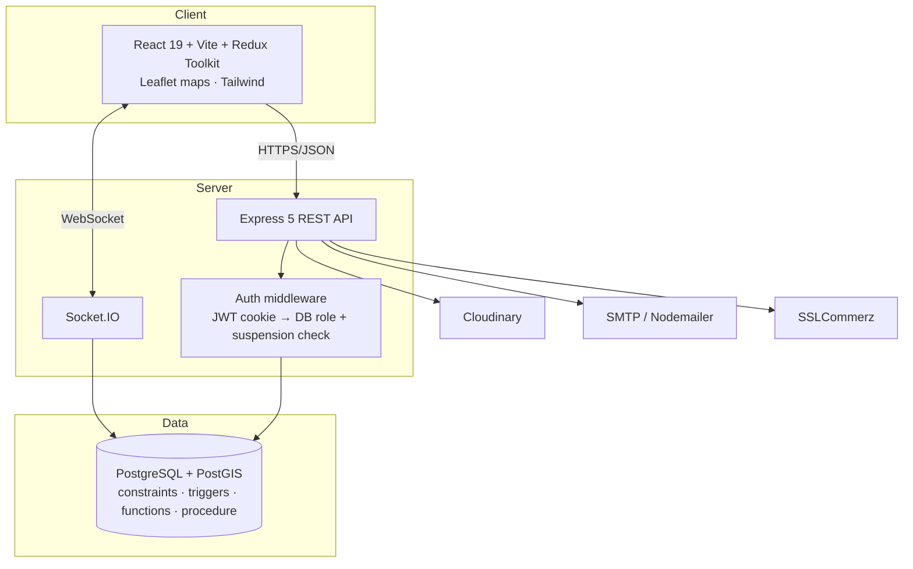
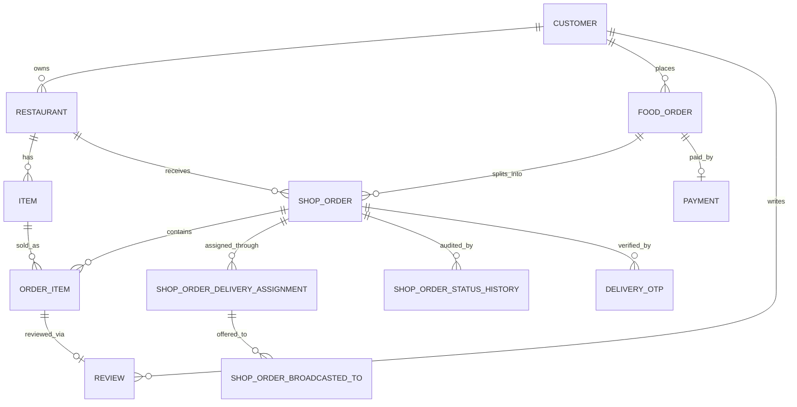
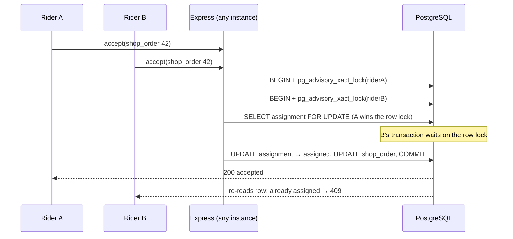

# 🍔 KhaiDai — A Database-Driven Food Ordering & Real-Time Delivery Platform

> Four-role marketplace (customer · restaurant owner · rider · admin) where **PostgreSQL + PostGIS enforces the business rules** and the application layer orchestrates them. Built at BUET CSE (2-1, Database Sessional) and still being extended.

[](#tech-stack)
[](#tech-stack)
[](#database-design)
[](#real-time-layer)

[]([https://www.youtube.com/watch?v=VIDEO_ID](https://www.youtube.com/watch?v=5SuGwjlvvss&t=7s)) ·  **Repo:** [unthinkingFool/buet-cse-2-1-project-food-order-and-delivery](https://github.com/unthinkingFool/buet-cse-2-1-project-food-order-and-delivery)

<!-- Add 3–4 screenshots/GIFs here: customer home, owner order board, rider live map, admin dashboard. -->

---

## TL;DR — what this project demonstrates

| Skill area | Evidence in this repo |
|---|---|
| **Relational modeling** | 19 tables, 8 enum types, one checkout decomposed into per-restaurant sub-orders (`FOOD_ORDER → SHOP_ORDER → ORDER_ITEM`) with price snapshots |
| **Concurrency control** | Three-layer protection on rider acceptance: advisory lock → `SELECT … FOR UPDATE` → partial unique indexes ([details](#concurrency--race-condition-handling)) |
| **Database-enforced business logic** | 22 triggers, 4 query functions, 1 PL/pgSQL procedure: audit history, rating aggregation, review-purchase validation, role validation, cached counters |
| **Geospatial engineering** | PostGIS `geography` + GiST index + `ST_DWithin` rider discovery inside a SQL function; trigger keeps scalar lat/long and the geography point consistent |
| **Real-time systems** | Socket.IO rooms per user, live rider tracking on Leaflet maps, persisted notifications so offers survive disconnects |
| **Security** | bcrypt (cost 12), HTTP-only `SameSite=strict` JWT cookies, role re-read from the DB on every request, per-request suspension check, hashed expiring single-use delivery OTP, parameterized SQL only |
| **Full-stack delivery** | ~69 REST endpoints, 4 role-specific dashboards, ~8.5k lines of React, ~7.8k lines of backend JS, ~1.5k lines of SQL |

---

## Table of contents

1. [Features by role](#features-by-role)
2. [Architecture](#architecture)
3. [Hard design decisions](#hard-design-decisions-and-trade-offs)
4. [Database design](#database-design)
5. [Concurrency & race-condition handling](#concurrency--race-condition-handling)
6. [Business logic](#business-logic)
7. [Database optimization](#database-optimization)
8. [Real-time layer](#real-time-layer)
9. [Security](#security)
10. [Known limitations & roadmap](#known-limitations--roadmap)
11. [Getting started](#getting-started)
12. [API overview](#api-overview)
13. [Project structure](#project-structure)
14. [Credits](#credits)

---

## Features by role

**Customer** — location-aware city discovery, food search with relevance ranking, multi-restaurant cart, COD or online checkout, live order tracking with rider position on a map, delivery OTP, item reviews, issue reporting.

**Restaurant owner** — restaurant onboarding (admin-approved), menu CRUD with Cloudinary images, availability and open/closed toggles, order board with status transitions, sales and delivery statistics.

**Rider** — online presence, continuous geolocation streaming, nearby delivery offers, one-tap accept (race-safe), OTP-verified delivery completion, delivery statistics.

**Admin** — separate auth domain; restaurant approve/reject/suspend, user suspension, platform dashboard, order and issue inspection.

---

## Architecture


```mermaid
flowchart TB
    subgraph Client
      FE["React 19 + Vite + Redux Toolkit<br/>Leaflet maps · Tailwind"]
    end
    subgraph Server
      API["Express 5 REST API"]
      WS["Socket.IO"]
      MW["Auth middleware<br/>JWT cookie → DB role + suspension check"]
    end
    subgraph Data
      PG[("PostgreSQL + PostGIS<br/>constraints · triggers · functions · procedure")]
    end
    FE -->|HTTPS/JSON| API
    FE <-->|WebSocket| WS
    API --> MW --> PG
    WS --> PG
    API --> CLD[Cloudinary]
    API --> MAIL[SMTP / Nodemailer]
    API --> PAY[SSLCommerz]
```

**Request path:** router → `isAuth` / `adminAuth` → controller (validation, authorization, orchestration) → transaction on a pooled client → DB (constraints, triggers, functions) → `COMMIT` → Socket.IO emit. Events are emitted **after commit**, so clients never hear about state that later rolls back.

---

## Hard design decisions and trade-offs

Each of these was a deliberate choice with a cost.

**1. One checkout, many restaurants → `FOOD_ORDER` + `SHOP_ORDER`.**
A customer can order from several restaurants at once, but each restaurant prepares, cancels and hands off independently. Modeling a single order would force awkward partial states, so the customer-facing order and the restaurant-facing order are separate entities. *Cost:* extra joins and a two-level status story.

**2. Riders are `CUSTOMER` rows with `role = 'rider'`, not a separate table.**
One identity, one auth path, one location column. A trigger (`validate_assigned_rider`) guarantees an assignment can only point at a real rider. *Cost:* a wide user table, and role checks must be enforced, not assumed.

**3. Delivery *offer* and delivery *assignment* are different things.**
`SHOP_ORDER_DELIVERY_ASSIGNMENT` tracks `broadcasted → assigned → completed`; `SHOP_ORDER_BROADCASTED_TO` records which riders were offered the job. Separating them lets the system prove a rider was actually eligible to accept and keeps completed assignments as history.

**4. Defense in depth for concurrency instead of trusting one mechanism.**
App-level checks give friendly errors, row locks serialize the common case, the advisory lock closes the "lock the absence of a row" gap, and unique indexes make a bad state *unrepresentable* even if every other layer fails or another server instance is running.

**5. Role is re-read from the database on every request.**
JWTs prove identity, not current permission. Reading role and suspension status from PostgreSQL means a suspension or role change takes effect immediately instead of when a token expires. *Cost:* one extra query per request (cacheable later).

**6. Prices are re-read from the DB and snapshotted into `ORDER_ITEM`.**
The client sends item ids and quantities only. Totals are computed server-side, and the price at purchase time is stored, so later menu edits never rewrite order history.

**7. PostGIS `geography(Point, 4326)` instead of hand-rolled Haversine.**
Distances come back in meters, spatial predicates can use a GiST index, and the logic lives in one SQL function (`get_nearby_available_riders`). Socket updates write only the geography column while REST writes scalar lat/long, so a trigger (`sync_customer_location`) keeps both representations consistent.

**8. Cached counters are trigger-maintained, with a ground-truth function beside them.**
`ITEM.total_sold` is updated only when a shop order crosses the `delivered` boundary (and reverses if it leaves it). `get_item_total_sold()` recomputes from source rows, so the cache can always be verified.

**9. Delivery completion is a stored procedure.**
After the app verifies the OTP, `complete_delivery()` locks the order and, in one atomic step, completes the assignment, marks the order delivered (which fires the audit and counter triggers) and creates the customer notification.

**10. Owners cannot mark an order `delivered`; riders can't either, without the customer's OTP.**
Delivery proof is a hashed, 10-minute, single-use OTP emailed to the customer. Neither party can unilaterally close the loop.

**11. No nearby rider ⇒ the order cannot go `out_for_delivery`.**
This is an intentional business rule: an order never enters a state where nobody is able to pick it up. The status change rolls back and the order stays in `preparing`.

**12. Business rules live in the database as well as the controllers.**
Review validation (only the buyer, only delivered items, item must match) exists in a trigger even though the API checks it too, so direct SQL, scripts and future services can't bypass it.

---

## Database design

**PostgreSQL 14+ with PostGIS.** The database is an active participant: it enforces invariants, records history and computes aggregates.

### Core entity relationships


```mermaid
erDiagram
    CUSTOMER ||--o{ RESTAURANT : owns
    CUSTOMER ||--o{ FOOD_ORDER : places
    CUSTOMER ||--o{ REVIEW : writes
    RESTAURANT ||--o{ ITEM : has
    RESTAURANT ||--o{ SHOP_ORDER : receives
    FOOD_ORDER ||--o{ SHOP_ORDER : splits_into
    FOOD_ORDER ||--o| PAYMENT : paid_by
    SHOP_ORDER ||--o{ ORDER_ITEM : contains
    ITEM ||--o{ ORDER_ITEM : sold_as
    ORDER_ITEM ||--o| REVIEW : reviewed_via
    SHOP_ORDER ||--o{ SHOP_ORDER_DELIVERY_ASSIGNMENT : assigned_through
    SHOP_ORDER_DELIVERY_ASSIGNMENT ||--o{ SHOP_ORDER_BROADCASTED_TO : offered_to
    SHOP_ORDER ||--o{ SHOP_ORDER_STATUS_HISTORY : audited_by
    SHOP_ORDER ||--o{ DELIVERY_OTP : verified_by
```

Supporting tables: `ADMIN`, `NOTIFICATION`, `ISSUES`, `PASSWORD_RESET`, `SUSPENED_EMAILS`, `LOCATION`, `AUDIT_LOG`.

### Integrity features

- **Enums** for roles, order status, assignment status, payment method/provider, item category, food type, restaurant status.
- **CHECK constraints:** latitude/longitude ranges, `price >= 0`, `quantity > 0`, rating bounds, payment status set, `issue sender ≠ target`.
- **Foreign keys** with `ON DELETE CASCADE` only where the child has no meaning without the parent.
- **Unique constraints:** email, `PAYMENT.order_id` (one payment per order), `PAYMENT.transaction_id`, one review per customer per order item.

### Triggers, functions and procedures

| Object | Purpose |
|---|---|
| `set_updated_at` (×5 tables) | Consistent `updated_at` without relying on app code |
| `sync_customer_location` | Keeps scalar lat/long and PostGIS point consistent regardless of which path wrote |
| `log_shop_order_status_change` | Append-only status history (`old → new`, timestamp) |
| `maintain_item_total_sold` | Cached sales counter, adjusted only at the `delivered` boundary, reversible |
| `refresh_rating_summaries` | Recomputes item and restaurant ratings from reviews |
| `validate_review_purchase` | Buyer-only, delivered-only, item-must-match |
| `validate_assigned_rider` / `validate_delivery_assignment_rider` | Assignments can only reference real riders |
| `validate_gmail` | Email format enforced at insert |
| `log_table_change` (×9 tables) | Generic audit log of insert/update/delete |
| `get_nearby_available_riders(restaurant, radius)` | Spatial query + availability filter, ordered by distance |
| `get_restaurant_delivery_statistics`, `get_rider_delivery_statistics` | Single-pass aggregates using `FILTER` |
| `get_item_total_sold` | Ground-truth recomputation |
| `complete_delivery(shop_order, rider)` | Atomic delivery completion (procedure) |

---

## Concurrency & race-condition handling

The hardest correctness problem in the system: **many riders can tap "Accept" on the same delivery at the same moment, and one rider can tap "Accept" on two deliveries at once.** The invariants are:

1. A delivery is accepted by **at most one** rider.
2. A rider holds **at most one** active delivery.


```mermaid
sequenceDiagram
    participant R1 as Rider A
    participant R2 as Rider B
    participant API as Express (any instance)
    participant DB as PostgreSQL
    R1->>API: accept(shop_order 42)
    R2->>API: accept(shop_order 42)
    API->>DB: BEGIN + pg_advisory_xact_lock(riderA)
    API->>DB: BEGIN + pg_advisory_xact_lock(riderB)
    API->>DB: SELECT assignment FOR UPDATE (A wins the row lock)
    Note over DB: B's transaction waits on the row lock
    API->>DB: UPDATE assignment → assigned, UPDATE shop_order, COMMIT
    DB-->>R1: 200 accepted
    DB-->>R2: re-reads row: already assigned → 409
```

| Race | Layer that stops it |
|---|---|
| Two riders accept the same delivery | `SELECT … FOR UPDATE` on the assignment and shop-order rows; the loser re-reads committed state and gets `409` |
| One rider accepts two different deliveries concurrently | `pg_advisory_xact_lock(rider_id)` serializes accepts per rider. `FOR UPDATE` can't lock a row that *doesn't exist yet*, so this closes the "both saw no active order" gap. Released automatically at `COMMIT`/`ROLLBACK`, and works across multiple server instances |
| Anything that slips past application logic (another service, a bug, a manual SQL write) | Partial unique indexes: `uq_active_delivery_assignment_per_shop_order` (one live assignment per order) and `uq_active_delivery_assignment_per_rider` (one `assigned` row per rider). A violation (`23505`) is mapped to a clean `409` |
| Two owners/requests broadcasting the same order | Shop order is row-locked while the broadcast is created |
| OTP verified twice / concurrently | OTP row locked `FOR UPDATE`, `verified` checked inside the transaction, completion done in `complete_delivery` under another row lock |
| Duplicate reviews | `UNIQUE (customer_id, order_item_id)` |
| Duplicate payment for one order | `UNIQUE (order_id)` on `PAYMENT` |

**Why partial indexes?** `WHERE assignment_status IN ('broadcasted','assigned')` lets historical `completed` rows coexist while forbidding two *live* rows, a constraint a plain `UNIQUE` can't express.

---

## Business logic

**Order lifecycle (per restaurant):**

```text
pending → confirmed → preparing → out_for_delivery → delivered
                                       ▲
              requires ≥1 nearby available rider
```

- Delivery fee is computed server-side (free above a subtotal threshold).
- On `out_for_delivery`, the system creates **one** assignment, queries riders within 1 km via PostGIS, records every eligible rider in `SHOP_ORDER_BROADCASTED_TO`, writes a persistent notification for each, and emits a Socket.IO offer.
- A rider may only accept a job that was broadcast to them.
- Only the assigned rider, with a valid OTP, can complete delivery.

**"Available rider"** means: role is rider, within the radius, no active shop order, and no active assignment.

**Ratings:** only delivered items can be reviewed, only by the purchaser, once per order item; item and restaurant averages are recomputed by trigger.

**Moderation:** restaurants start unapproved. Admins approve, reject or suspend; suspended emails are blocked at sign-in and registration and checked on every authenticated request.

---

## Database optimization

- **GiST spatial index** on `CUSTOMER.location` for radius queries.
- **Partial indexes** on active riders and active assignments: small, hot indexes that ignore historical rows.
- **Indexes on OTP lookups** (`shop_order_id`, `rider_id`, `customer_email`).
- **Push computation into SQL:** statistics use `COUNT(*) FILTER (…)` / `SUM … FILTER` in a single scan instead of several round trips or app-side loops.
- **Trigger-maintained counters** avoid re-aggregating order history on every menu render.
- **Pooled connections** (`pg.Pool`) with explicit `connect → BEGIN → COMMIT/ROLLBACK → release` for multi-step operations.
- **Search ranking in SQL:** exact match → prefix → substring ordering via `CASE`.
- **Event-driven location updates** over WebSocket instead of client polling.

> Performance note: figures from `EXPLAIN ANALYZE` and concurrent-load tests are on the roadmap below. Nothing here claims benchmark numbers that haven't been measured.

---

## Real-time layer

- Clients register with an `identity` event and join a private room `user:<id>`; the server tracks `socket_id` and `isonline` and clears them on disconnect.
- Riders stream `updateLocation` (browser `watchPosition`) → PostGIS update → broadcast to customers tracking the delivery.
- Targeted events: `new_shop_order`, `order_status_changed`, `order_rider_assigned`, `new_delivery_offer`.
- Offers are **also persisted** in `NOTIFICATION`, so a rider who was offline at broadcast time doesn't lose them.
- Events fire after the DB transaction commits.

---

## Security

- Passwords: bcrypt, cost 12.
- Sessions: JWT in `httpOnly`, `SameSite=strict` cookie; separate `adminToken` cookie and middleware for the admin domain.
- Authorization: role and suspension are read from the DB per request; owner-only and rider-only actions are checked in controllers; ownership is validated in the query (`WHERE id = $1 AND owner_id = $2`).
- Injection: all queries are parameterized.
- Delivery OTP: 6 digits, bcrypt-hashed, 10-minute expiry, single use.
- Password reset: hashed OTP with expiry and verified-state tracking.
- Uploads: Multer → Cloudinary; DB stores only the URL.

---

## Known limitations & roadmap

Stating these plainly is deliberate. The project is under active development.

**Known limitations**

- **Payments:** SSLCommerz initiation is implemented; success/fail/cancel/IPN callbacks and server-side validation are not yet wired, because sandbox access needs a merchant account that hasn't been provisioned. Gateway call currently happens inside the DB transaction and should be moved outside it.
- **Sockets:** `identity`/`updateLocation` trust a client-supplied user id and location broadcasts go to all clients; both should be bound to the authenticated session and scoped to the relevant customer room.
- **Order cancellation** deletes the shop order; it should become a `cancelled` status so history is preserved. Status transitions aren't yet validated against an explicit state machine.
- **Checkout checks:** item availability and restaurant-open state aren't re-validated at order creation.
- **OTP brute-force:** no attempt limit yet.
- **Search:** `ILIKE '%…%'` won't use a B-tree at scale.
- **Production hardening:** `secure` cookies, env-driven CORS, rate limiting, security headers.
- **Testing:** no automated test suite yet.

**Roadmap**

1. **Concurrency test harness:** N parallel accepts, assert exactly one winner; publish results.
2. **Performance pass:** `EXPLAIN ANALYZE` on hot queries, `pg_trgm` GIN index for search, k6 load tests.
3. **Payment callbacks** and idempotent webhook handling.
4. **Socket authentication** and room-scoped tracking.
5. **State-machine table** for allowed order transitions; soft-cancel.
6. **CI** with integration tests against a PostGIS container.
7. **AI features** (planned): natural-language / semantic menu search, ETA and demand prediction, smarter rider ranking beyond straight-line distance.

---

## Getting started

**Prerequisites:** Node.js 20+, PostgreSQL 14+ with PostGIS. Optional: Cloudinary, Gmail app password, SSLCommerz sandbox credentials.

```bash
git clone https://github.com/unthinkingFool/buet-cse-2-1-project-food-order-and-delivery.git
cd buet-cse-2-1-project-food-order-and-delivery

# backend
cd backend && npm install

# frontend
cd ../frontend && npm install
```

**Database** (run in this order):

```bash
createdb khaidai
psql -d khaidai -f backend/config/database.sql                 # schema (⚠ contains DROP statements; for fresh setup only)
psql -d khaidai -f backend/config/database_business_logic.sql  # triggers, functions, procedure
psql -d khaidai -f backend/config/concurrency_hardening.sql    # idempotent index hardening
```

Create an admin by generating a bcrypt hash (see `backend/config/generateAdminPassword.js`, and **change the password in that script first**) and inserting it into `ADMIN`.

**Backend `.env`:**

```env
BACKEND_PORT=...

DB_HOST=localhost
DB_PORT=...
DB_NAME=khaidai
DB_USER=postgres
DB_PASSWORD=.....

NODE_ENV=development

JWT_SECRET_KEY=.....

EMAIL_USER=.........
EMAIL_PASSWORD=.......

CLOUDINARY_CLOUD_NAME=.....
CLOUDINARY_API_SECRET=.....
CLOUDINARY_API_KEY=......


SSLCOMMERZ_STORE_ID=....
SSLCOMMERZ_STORE_PASSWORD= ....
SSLCOMMERZ_IS_SANDBOX=true
```

**Frontend `.env`:** `VITE_GEOAPIFY_API_KEY=...` (geocoding) plus the backend URL variable used in `frontend/src`.

```bash
cd backend && npm run dev      # API + Socket.IO
cd frontend && npm run dev     # http://localhost:5173
```

Never commit `.env` files.

---

## API overview

~69 endpoints under `/api`. Protected routes use the `token` cookie; admin routes use `adminToken`.

| Module | Examples |
|---|---|
| `/auth` | signup, signin, signout, send-otp, verify-otp, reset-password |
| `/user` | current user, update location, received orders, delivery notifications |
| `/restaurant` | create/edit, by city, menu, completed orders, statistics, open/close |
| `/item` | add/edit/delete, availability, search, total sold, rating |
| `/order` | create, list, shop-order detail, **status update (owner)** |
| `/rider` | broadcasted jobs, **accept**, assigned, delivered, statistics, send/verify delivery OTP |
| `/delivery` | assigned-rider lookup |
| `/payment` | initiate |
| `/issues` | report, my issues |
| `/admin` | login, dashboard, restaurants (approve/reject/suspend), users, orders, issues |

---

## Project structure

```text
backend/
  config/        db pool, mail, schema + business-logic SQL
  controllers/   admin · auth · delivery · deliveryOtp · forget · issues · item · order · payment · restaurant · rider · user
  middlewares/   isAuth · adminAuth · multer
  routes/        one router per module
  utils/         jwt · otp · cloudinary
  socket.js      Socket.IO identity, location, presence
frontend/src/
  pages/         route-level screens (customer, owner, rider, admin)
  components/    dashboards, cards, navigation
  hooks/         API data hooks
  redux/         user · owner · rider · admin · map slices
testDocs/        sample images for seeding menus
```

---

## Credits

Built for BUET CSE 2-1 Database Management Sessional.

**Swapnil Das** ([@unthinkingFool](https://github.com/unthinkingFool) · [LinkedIn](https://www.linkedin.com/in/swapnil-das-603824236)): project lead and primary developer.
Product and system design; the complete React frontend; REST API and business workflows (multi-restaurant order decomposition, status flow, rider broadcast and acceptance, delivery OTP, payments initiation); PostGIS rider discovery; row-level locking flow; authentication, authorization and security; Socket.IO real-time layer; the trigger and function suite in `database_business_logic.sql`; system integration.

**Nazmul Hasan Rafi:** database collaborator.
Relational schema and database feature work, including the per-rider advisory-lock serialization, the first version of the concurrency-protecting partial unique indexes, the initial `complete_delivery` procedure and statistics functions, and related controller hardening.

---

_KhaiDai is actively maintained. Issues and suggestions are welcome._
